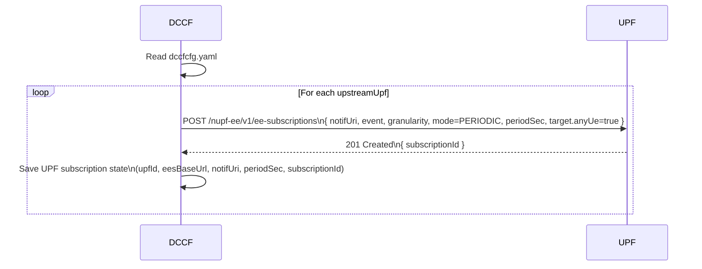
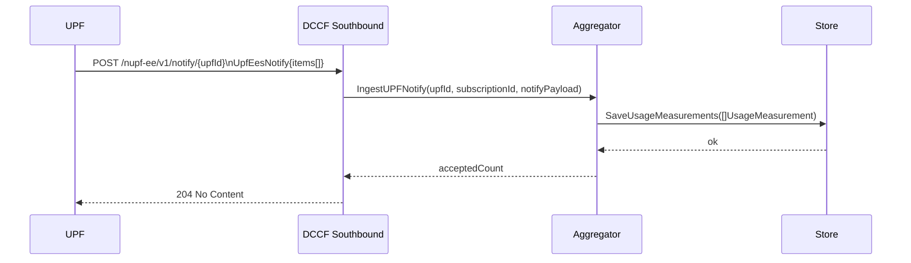
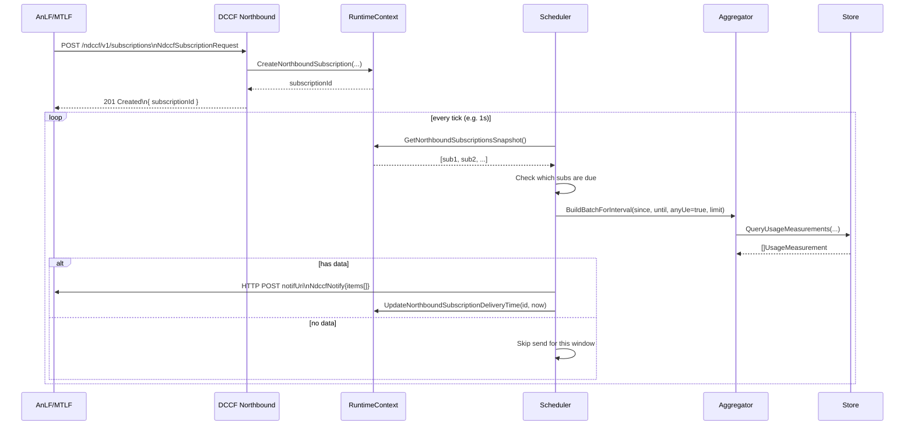
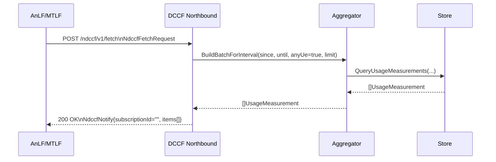

# DCCF MVP – UPF Event Exposure Collector for NWDAF

This repository implements a **minimal DCCF (Data Collection & Coordination Function)** that:

- **Subscribes directly to UPF Event Exposure (Nupf_EventExposure)** for  
  `USER_DATA_USAGE_MEASURES` (per PDU session, any UE).
- **Collects interval-based usage measurements** (bytes/packets, UL/DL, time window).
- **Stores them in an in-memory store** (MVP).
- **Exposes a simple Ndccf-like northbound API** so AnLF / MTLF can:
  - register **periodic push** subscriptions, and
  - issue **one-shot fetch** requests.

This is designed to integrate with a modified `go-upf` that already supports
`Nupf_EventExposure::USER_DATA_USAGE_MEASURES` via UPF-EES.

> **Status:** MVP, focused on correctness and readability, not production scale.
> Many features are deliberately left as future work (NRF discovery, persistent DB,
> full filter support, security, etc.).

---

## 1. High-Level Architecture

DCCF sits between **UPF EES** and **NWDAF analytics functions**:

- **Southbound**: receives `Notify` from UPF EES and normalizes data.
- **Core**: aggregates and stores usage measurements.
- **Northbound**: exposes Ndccf-like APIs to AnLF / MTLF and pushes notifications
  according to subscriptions.

### 1.1 Logical Position

```mermaid
flowchart LR
  UE -->|GTP-U| UPF[UPF with EES]

  subgraph Core
    SMF
  end

  subgraph Analytics
    DCCF
    AnLF
    MTLF
  end

  UPF -- "Nupf_EventExposure\n(USER_DATA_USAGE_MEASURES)" --> DCCF
  DCCF -- "Ndccf Data Management\n(subscribe / fetch / notify)" --> AnLF
  DCCF -- "Ndccf Data Management\n(subscribe / fetch / notify)" --> MTLF
````

**MVP assumptions:**

* DCCF runs as an independent NF (standalone Go binary).
* UPF EES is already enabled and exposes a REST API.
* DCCF **subscribes directly to UPF**, not via SMF.
* NRF registration, health checks, and security are **not implemented yet**.

---

## 2. Internal Components

The code roughly follows the `free5gc` NF layout:

```text
dccf/
├─ cmd/                     # Entry point (main.go)
├─ internal/
│  ├─ logger/               # Category-based loggers (main, cfg, southbound, ...)
│  ├─ context/              # RuntimeContext: UPF & northbound subscription states
│  ├─ model/                # Shared types (UPF Notify, Ndccf req/resp, internal records)
│  ├─ storage/              # Store interface + in-memory implementation
│  ├─ aggregator/           # UPF Notify → UsageMeasurement → storage
│  ├─ sbi/
│  │  ├─ client_upf.go      # Nupf_EventExposure subscribe/unsubscribe client
│  │  └─ server_northbound.go  # Ndccf-like northbound HTTP server
│  ├─ southbound/
│  │  └─ upf_ees_receiver.go   # HTTP receiver for UPF EES Notify
│  ├─ northbound/
│  │  └─ notifier.go        # HTTP notifier: DCCF → AnLF/MTLF
│  └─ scheduler/
│     └─ scheduler.go       # Periodic push loop based on northbound subscriptions
├─ pkg/
│  ├─ factory/              # Config structures + YAML loading & validation
│  └─ app/                  # Wires everything together (App.Start / App.Stop)
├─ config/
│  └─ dccfcfg.yaml          # DCCF configuration
└─ go.mod / go.sum
```

### 2.1 Data Model (what we actually collect)

From UPF, we receive **interval-based** usage per PDU Session:

* `localSeid`, `remoteSeid`
* `ulBytes`, `dlBytes`
* `ulPackets`, `dlPackets`
* `startTime`, `endTime`
* optional `ulThroughputBps`, `dlThroughputBps`

DCCF normalizes this into:

```go
type UsageMeasurement struct {
    SourceUPFID string    // which UPF this came from
    LocalSEID   uint64
    RemoteSEID  uint64
    ULBytes     uint64
    DLBytes     uint64
    ULPackets   uint64
    DLPackets   uint64
    StartTime   time.Time
    EndTime     time.Time
    ULThroughputBps float64
    DLThroughputBps float64
}
```

And on the **northbound** side the payload is:

```go
type NdccfNotify struct {
    SubscriptionID string             `json:"subscriptionId"` // empty for fetch
    EventID        EventType          `json:"eventId"`        // USER_DATA_USAGE_MEASURES
    Granularity    GranularityType    `json:"granularity"`    // perPduSession
    Timestamp      time.Time          `json:"timestamp"`
    Items          []UsageMeasurement `json:"items"`
}
```

---

## 3. Packet Flows

### 3.1 Startup: DCCF → UPF EES Subscription

On startup, DCCF:

1. Reads `config/dccfcfg.yaml`.
2. For each `southbound.upstreamUpfs[]`:

   * Builds a `notifUri` that points back to DCCF.
   * Sends a **PERIODIC** subscription request to UPF EES.
   * Records `subscriptionId` in its `RuntimeContext`.



**MVP fixed values:**

* `event`: `USER_DATA_USAGE_MEASURES`
* `granularity`: `perPduSession`
* `mode`: `PERIODIC`
* `target`: `{ "anyUe": true }`

---

### 3.2 Southbound: UPF EES Notify → DCCF

UPF periodically reports usage measurements to DCCF:

1. UPF detects a `USER_DATA_USAGE_MEASURES` event for one or more sessions.
2. UPF sends HTTP `POST` to DCCF’s `notifUri`:

   * Path: `/nupf-ee/v1/notify/{upfId}`
   * Body: `UpfEesNotify` (contains items with interval usage).
3. DCCF:

   * Parses `{upfId}` from the URL.
   * Decodes JSON into `UpfEesNotify`.
   * Normalizes each item to `UsageMeasurement`.
   * Persists via `storage.Store`.



If there are no items, DCCF still returns `204 No Content`, but nothing is saved.

---

### 3.3 Northbound (Push): AnLF / MTLF Subscriptions + Scheduler

For **periodic notifications**:

1. AnLF or MTLF sends `POST /ndccf/v1/subscriptions` to DCCF.
2. DCCF validates the request and creates an internal subscription in `RuntimeContext`.
3. The scheduler wakes up (every 1s), checks all subscriptions, and for each **due** one:

   * Computes a `[start, end]` time window.
   * Queries `Aggregator.BuildBatchForInterval()`.
   * If there is data, builds `NdccfNotify` and sends it to `notifUri`.
   * Updates `LastDeliveredAt` for that subscription.



**MVP constraints:**

* Only `anyUe = true` is supported.
* Only `USER_DATA_USAGE_MEASURES` / `perPduSession`.
* If `notifUri` is empty, the subscription is effectively **pull-only** (no push).

---

### 3.4 Northbound (Pull): One-shot Fetch

For **on-demand pull**, AnLF / MTLF can request data without creating a subscription:

1. AnLF/MTLF sends `POST /ndccf/v1/fetch`.
2. DCCF validates the request.
3. DCCF calls `Aggregator.BuildBatchForInterval()` with the given `since` / `until` / `limit`.
4. DCCF returns a `NdccfNotify`-shaped response (but with empty `subscriptionId`).



---

## 4. Configuration (`config/dccfcfg.yaml`)

Example minimal config:

```yaml
info:
  version: "1.0.0"
  description: "DCCF MVP - collects UPF EES USER_DATA_USAGE_MEASURES and serves Ndccf northbound"

southbound:
  # DCCF address that UPF EES will send Notify to.
  # notifUri = "http://<listenAddr>/nupf-ee/v1/notify/{upfId}"
  listenAddr: "0.0.0.0:8088"

  # List of UPFs to subscribe to (direct Nupf_EventExposure, no SMF in between).
  upstreamUpfs:
    - id: "upf-a"
      eesBaseUrl: "http://127.0.0.1:8088/nupf-ee/v1"
      periodSec: 10

northbound:
  # DCCF address where AnLF/MTLF send subscriptions & fetch.
  listenAddr: "0.0.0.0:8090"

  enablePush: true
  defaultPeriodSec: 10
  batchMaxItems: 500
  delayToleranceSec: 3

storage:
  driver: "memory"
  maxItems: 0   # 0 = no explicit limit
  ttlSec: 0     # 0 = no TTL-based cleanup

security:
  enableTLS: false

nrf:
  enableDiscovery: false
  uri: ""

logging:
  level: "debug"
  reportCaller: false
```

> ⚠️ **Important:** `southbound.listenAddr` must be a host/IP that your UPF can reach.
> `0.0.0.0` is usually fine for local testing, but when forming `notifUri`
> you may want to replace it with an explicit IP in production/testbed.

---

## 5. Build & Run

### 5.1 Initialize module (once)

In the repo root:

```bash
go mod tidy
```

(If you forked this repo under a different Go module path, make sure the
`import` paths under `github.com/free5gc/dccf/...` are updated accordingly.)

### 5.2 Build

```bash
go build -o bin/dccf ./cmd
```

### 5.3 Run

```bash
./bin/dccf -c ./config/dccfcfg.yaml
```

Logs will show:

* Config loaded & printed.
* Southbound / northbound servers listening.
* For each UPF:

  * Subscribe request + returned `subscriptionId`.
  * UPF subscription state recorded.

---

## 6. Northbound API Examples

### 6.1 Create Subscription (Periodic Push)

```bash
curl -sS -X POST http://127.0.0.1:8090/ndccf/v1/subscriptions \
  -H "Content-Type: application/json" \
  -d '{
        "notifUri": "http://127.0.0.1:9000/callback",
        "event": "USER_DATA_USAGE_MEASURES",
        "granularity": "perPduSession",
        "periodSec": 10,
        "anyUe": true
      }'
```

Response:

```json
{
  "subscriptionId": "sub-1"
}
```

DCCF will then periodically push:

```http
POST /callback HTTP/1.1
Content-Type: application/json

{
  "subscriptionId": "sub-1",
  "eventId": "USER_DATA_USAGE_MEASURES",
  "granularity": "perPduSession",
  "timestamp": "2025-01-01T00:00:10Z",
  "items": [
    {
      "sourceUpfId": "upf-a",
      "localSeid": 12345,
      "remoteSeid": 67890,
      "ulBytes": 1024,
      "dlBytes": 2048,
      "ulPackets": 10,
      "dlPackets": 20,
      "startTime": "2025-01-01T00:00:00Z",
      "endTime": "2025-01-01T00:00:10Z",
      "ulThroughputBps": 819.2,
      "dlThroughputBps": 1638.4
    }
  ]
}
```

### 6.2 Delete Subscription

```bash
curl -sS -X DELETE http://127.0.0.1:8090/ndccf/v1/subscriptions/sub-1
```

* `204 No Content` if it existed.
* `404 Not Found` if not found.

### 6.3 One-shot Fetch

```bash
curl -sS -X POST http://127.0.0.1:8090/ndccf/v1/fetch \
  -H "Content-Type: application/json" \
  -d '{
        "event": "USER_DATA_USAGE_MEASURES",
        "granularity": "perPduSession",
        "anyUe": true,
        "limit": 100
      }'
```

Response (note `subscriptionId` is empty):

```json
{
  "subscriptionId": "",
  "eventId": "USER_DATA_USAGE_MEASURES",
  "granularity": "perPduSession",
  "timestamp": "2025-01-01T00:01:00Z",
  "items": [ /* same UsageMeasurement schema as above */ ]
}
```

If you specify `since` / `until`, they filter on the measurement time interval:

```json
{
  "event": "USER_DATA_USAGE_MEASURES",
  "granularity": "perPduSession",
  "anyUe": true,
  "since": "2025-01-01T00:00:00Z",
  "until": "2025-01-01T00:05:00Z"
}
```

---

## 7. Limitations & Future Work

This MVP intentionally implements only a **narrow slice** of DCCF:

* **Implemented**

  * Direct Nupf_EventExposure subscription (UPF ↔ DCCF).
  * `USER_DATA_USAGE_MEASURES` / `perPduSession` / `anyUe=true`.
  * Interval-based usage samples, not cumulative counters.
  * In-memory storage backend.
  * Simple northbound:

    * `POST /ndccf/v1/subscriptions` (create)
    * `DELETE /ndccf/v1/subscriptions/{id}` (delete)
    * `POST /ndccf/v1/fetch` (one-shot fetch)
  * Periodic push scheduler with basic delay tolerance.

* **Planned / future work**

  * **NRF integration** (Nnrf_NFDiscovery & NF registration).
  * **Authentication / authorization / TLS** for northbound and southbound.
  * **Persistent storage** (MongoDB / TSDB) with proper indexing.
  * **Richer targets & filters**:

    * UE IP, DNN, S-NSSAI, application/traffic filters, etc.
    * Better alignment with 3GPP event filter model.
  * **Multiple event types & granularities**, beyond `USER_DATA_USAGE_MEASURES`.
  * **Graceful HTTP shutdown** via `http.Server.Shutdown`.
  * **Observability**:

    * Prometheus metrics, health endpoints, structured request IDs.
  * **Testing harness** for:

    * fake UPF EES sender,
    * fake AnLF/MTLF subscriber,
    * deterministic replay of measurement traces.
